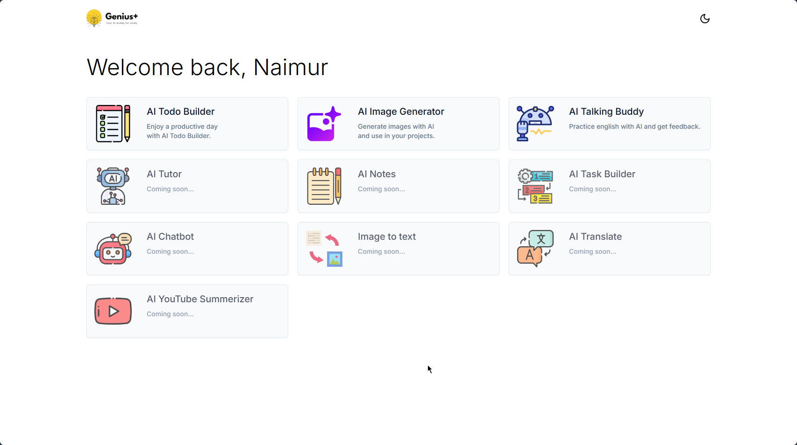

**Genius+** is an AI-powered productivity app for students! It helps generate daily to-do lists, manage tasks with ease, practice English through text-to-speech and speech-to-text, and even generate images using prompts or predefined options. It's the perfect companion for students to stay organized and improve their English skills!

🌐 **Live Project**: [Genius+](https://genius-plus-frontend.vercel.app/en)

🛠 **Admin Credentials**:  
**Email**: `admin@gmail.com`  
**Password**: `AluVaj!1*`

---



---

## 🚀 Features

- Generate a day’s to-do list based on your input 🌟
- Add, update, delete, and rearrange tasks manually ✍️
- Forward previous day's tasks to the current day 🔄
- Generate images via prompts or selecting from options 🎨
- Practice English with AI through text-to-speech and speech-to-text 🎤

---

## ⚠️ Ongoing Development & Known Issues

Genius Plus is an **ongoing project** 🚧 with **many more exciting features coming soon**! As it's still under construction, you may encounter **bugs** or inconveniences. We appreciate your patience and feedback as we continue to improve the app.

---

## 💻 Tech Stack

- **Framework**: Next.js
- **Styling**: Tailwind CSS, Sass
- **State Management**: Redux Toolkit
- **AI Integration**: Text-to-speech & speech-to-text APIs, Image generation APIs
- **Forms & Validation**: React Hook Form, Zod
- **Icons & UI**: Radix UI, Lucide-react
- **Other Libraries**: Axios, React-beautiful-dnd, JWT Decode

---

## 📦 Installation & Setup

### 1️⃣ Clone the repository:

```bash
git clone https://github.com/yourusername/genius-plus-frontend.git
```

### 2️⃣ Install dependencies:

```bash
cd genius-plus-frontend
bun install
```

### 3️⃣ Set up environment variables:

- Create a `.env.local` file in the root directory. and follow .env.example file.

### 4️⃣ Start the development server:

```bash
bun dev
```

The app will be available at `http://localhost:3000`.

---

## 🛠️ Available Scripts

- **Development**: `bun dev`
- **Production Build**: `bun run build` & `bun start`
- **Linting**: `bun run lint` and `bun lint:fix`
- **Prettier Formatting**: `bun run prettier:fix`
- **Prepare Husky**: `bun run prepare`

---

## 🌟 Contributing

We welcome contributions! Please feel free to submit issues, fork the repo, or open pull requests. Make sure to follow the coding standards and run linters before submitting!

---

## 📧 Contact

For any questions or support, reach out at [naeemhasan28@gmail.com](mailto:naeemhasan28@gmail.com).

---

Stay tuned for more updates! 🚀
